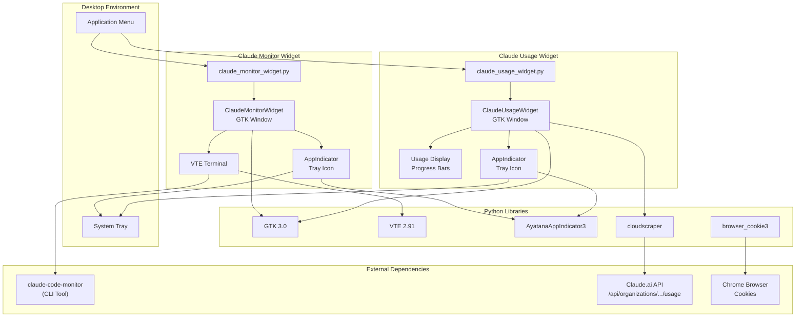
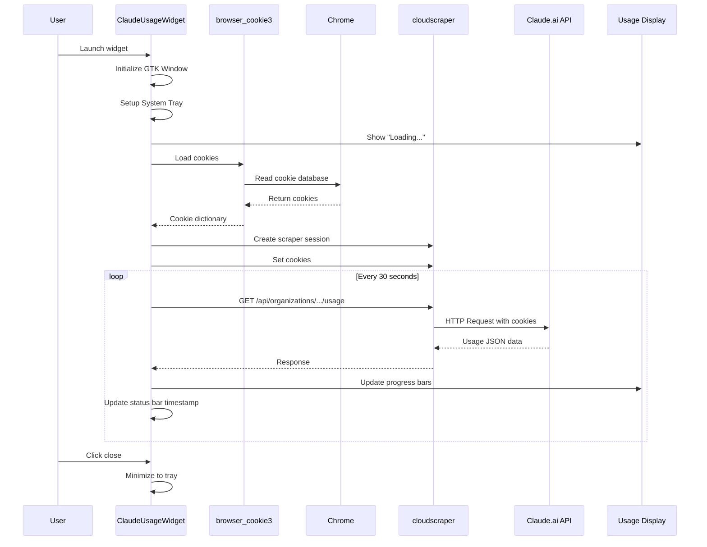
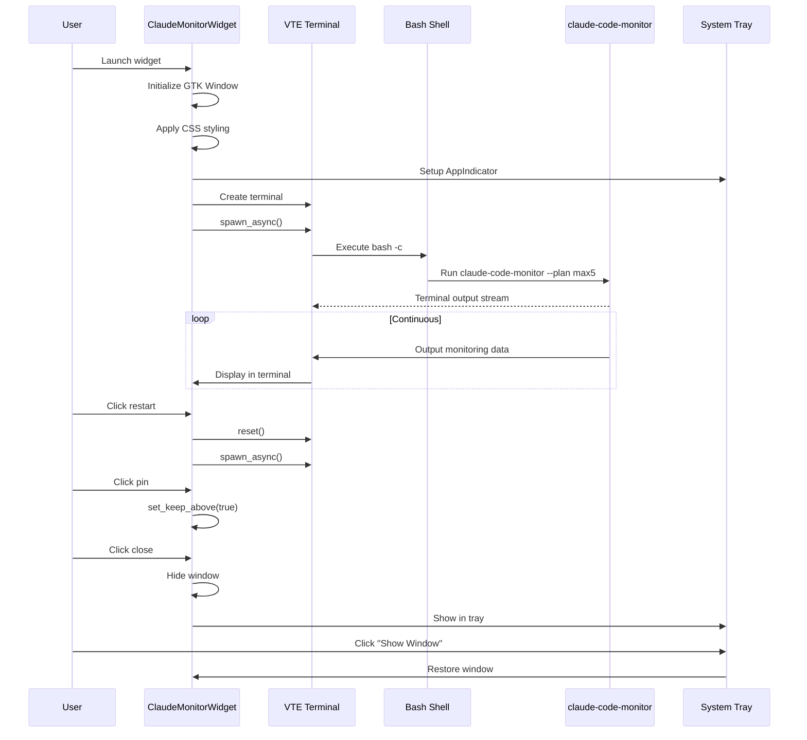
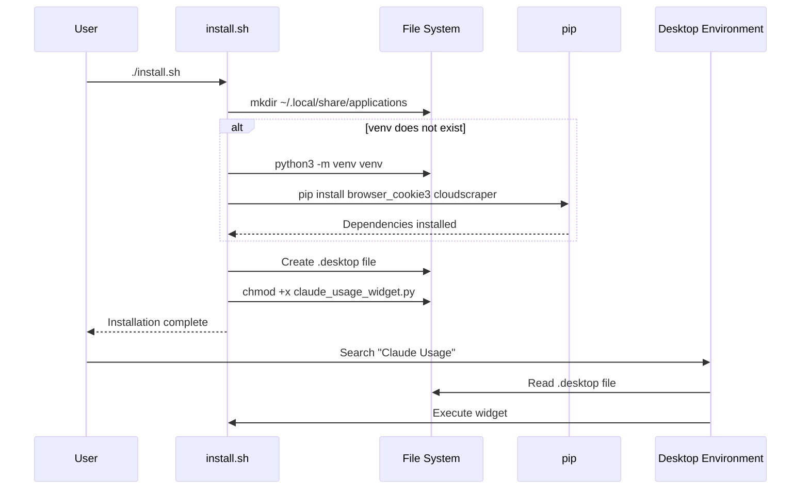

# Claude Monitor Widget - Technical Specification

## 1. Functional Requirements

This project provides two desktop widgets for monitoring Claude AI usage:

1. **Claude Monitor Widget** (`claude_monitor_widget.py`) - Embeds the `claude-code-monitor` CLI tool in a floating, transparent GTK window with system tray integration.

2. **Claude Usage Widget** (`claude_usage_widget.py`) - Fetches and displays Claude.ai API usage statistics directly from the Claude.ai web service using browser cookies for authentication.

### Key Features
- Frameless, transparent, draggable windows with Catppuccin-style dark theme
- System tray integration (minimize to tray, tray menu controls)
- Always-on-top pin mode
- Compact mode (monitor widget)
- Auto-refresh of usage data (30-second interval)
- Linux desktop integration via `.desktop` files

---

## 2. Component Architecture


[View Mermaid Source](tech_spec/mmd/component_diagram.mmd)

### Component Descriptions

| Component | Type | Description |
|-----------|------|-------------|
| `claude_monitor_widget.py` | Python Script | Main entry point for the monitor widget. Creates GTK window with embedded VTE terminal. |
| `claude_usage_widget.py` | Python Script | Main entry point for the usage widget. Fetches usage data from Claude.ai API. |
| `ClaudeMonitorWidget` | GTK Window Class | Manages the terminal-based monitor display, window controls, and tray integration. |
| `ClaudeUsageWidget` | GTK Window Class | Manages the usage display with progress bars, data fetching, and tray integration. |
| `VTE Terminal` | GTK Component | Virtual terminal emulator that runs `claude-code-monitor` CLI. |
| `AppIndicator` | System Component | System tray indicator (AyatanaAppIndicator3 or AppIndicator3). |
| `claude-code-monitor` | External CLI | Third-party tool for monitoring Claude Code usage (not included). |
| `Claude.ai API` | External Service | REST API endpoint for retrieving usage statistics. |
| `browser_cookie3` | Python Library | Extracts cookies from Chrome browser for API authentication. |
| `cloudscraper` | Python Library | HTTP client with Cloudflare bypass capabilities. |
| `install.sh` | Shell Script | Sets up Python venv, installs dependencies, creates desktop entry. |

---

## 3. Sequence Diagrams

### 3.1 Usage Widget Data Flow


[View Mermaid Source](tech_spec/mmd/usage_widget_sequence.mmd)

### 3.2 Monitor Widget Operation


[View Mermaid Source](tech_spec/mmd/monitor_widget_sequence.mmd)

### 3.3 Installation Process


[View Mermaid Source](tech_spec/mmd/installation_sequence.mmd)

---

## 4. Build and Deployment

### Dependencies

| Dependency | Type | Purpose |
|------------|------|---------|
| Python 3.12+ | Runtime | Script interpreter |
| GTK 3.0 | System Library | GUI framework |
| VTE 2.91 | System Library | Terminal emulator |
| gir1.2-ayatanaappindicator3-0.1 | System Package | System tray support (optional) |
| browser_cookie3 | Python Package | Cookie extraction from Chrome |
| cloudscraper | Python Package | HTTP client with CF bypass |

### Installation Steps

```bash
# 1. Clone or download the project
cd /path/to/claude-monitor-widget

# 2. Run installer (creates venv, installs deps, creates .desktop entry)
./install.sh

# 3. For system tray support (optional)
sudo apt install gir1.2-ayatanaappindicator3-0.1
```

### Running

```bash
# Direct execution
./claude_usage_widget.py
./claude_monitor_widget.py

# Or via application menu (after install.sh)
# Search for "Claude Usage" or "Claude Monitor"
```

### File Structure

```
claude-monitor-widget/
  claude_monitor_widget.py    # Monitor widget (terminal-based)
  claude_usage_widget.py      # Usage widget (API-based)
  claude-monitor-widget.desktop  # Desktop entry for monitor widget
  install.sh                  # Installation script
  venv/                       # Python virtual environment
```

---

## 5. API Definitions

### Claude.ai Usage API

| Endpoint | Method | Description |
|----------|--------|-------------|
| `/api/organizations/{org_id}/usage` | GET | Returns usage statistics for the authenticated user's organization |

**Request Headers:**
- Cookies from Chrome browser (authenticated session)

**Response Format (JSON):**

| Field | Type | Description |
|-------|------|-------------|
| `five_hour` | object | 5-hour rolling usage window |
| `five_hour.utilization` | float | Percentage of limit used (0-100) |
| `five_hour.resets_at` | string | ISO 8601 timestamp for reset |
| `seven_day` | object | 7-day rolling usage window |
| `seven_day.utilization` | float | Percentage of limit used (0-100) |
| `seven_day.resets_at` | string | ISO 8601 timestamp for reset |
| `seven_day_opus` | object | 7-day Opus model usage (optional) |
| `seven_day_sonnet` | object | 7-day Sonnet model usage (optional) |
| `extra_usage` | object | Additional usage metrics (optional) |

### Internal Widget Methods

| Method | Widget | Description |
|--------|--------|-------------|
| `spawn_monitor()` | Monitor | Spawns `claude-code-monitor --plan max5` in VTE terminal |
| `_fetch_usage()` | Usage | Fetches data from API in background thread |
| `_load_cookies()` | Usage | Extracts cookies from Chrome for `.claude.ai` domain |
| `on_toggle_always_on_top()` | Both | Toggles window keep-above state |
| `on_minimize_to_tray()` | Both | Hides window, keeps running in tray |
| `on_restart()` | Monitor | Resets terminal and respawns monitor process |

---

## 6. Data Schema

### Cookie Storage (In-Memory)

| Field | Type | Description |
|-------|------|-------------|
| `cookie_dict` | dict | Key-value pairs of cookie names and values |
| `scraper` | cloudscraper | HTTP session with cookies attached |

### Widget State

| Field | Widget | Type | Description |
|-------|--------|------|-------------|
| `is_always_on_top` | Both | bool | Window pinned above other windows |
| `is_compact` | Monitor | bool | Compact display mode (hides header/status) |
| `normal_size` | Both | tuple | Stored window dimensions for mode switching |
| `last_position` | Both | tuple | Stored window position for tray restore |
| `last_data` | Usage | dict | Cached API response data |
| `child_pid` | Monitor | int | PID of spawned monitor process |

---

## 7. Configuration

| Constant | File | Value | Description |
|----------|------|-------|-------------|
| `USAGE_URL` | usage widget | `https://claude.ai/api/organizations/{org_id}/usage` | API endpoint (hardcoded org ID) |
| `REFRESH_INTERVAL` | usage widget | `30` | Seconds between API refreshes |
| `--plan max5` | monitor widget | CLI flag | Subscription plan parameter for claude-code-monitor |

**Note:** The organization ID in `USAGE_URL` is hardcoded and would need modification for different accounts.
